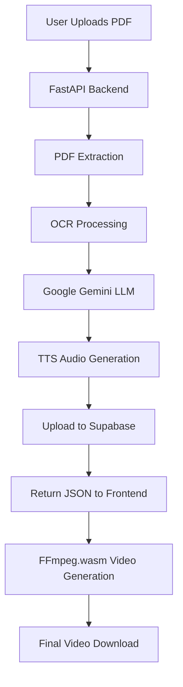

# 🎬 Manhwa.AI - AI-Powered Manga to Video Generator

<div align="center">

[](https://raw.githubusercontent.com/yourusername/yourrepository/main/assets/video.mp4)

[](https://manhwa-ai-theta.vercel.app)
[](https://manhwa-backend-h7g66jyc2q-el.a.run.app/docs)

[](CONTRIBUTING.md)

### ⚡ Transform Your Manga PDFs into Stunning Narrated Videos with AI

*Powered by Google Gemini, FFmpeg.wasm, and FastAPI | 100x Faster | Zero Backend Video Cost*

[Features](#-features) • [Demo](#-demo) • [Quick Start](#-quick-start) • [Architecture](#-architecture) • [Deployment](#-deployment) • [API Docs](#-api-documentation)

</div>

---

## 🌟 Features

<table>
<tr>
<td width="50%">

### 🎨 **Smart Panel Extraction**
- Automatic manga panel detection
- High-quality image processing (120 DPI)
- Handles vertical scrolling panels
- Filters out noise and artifacts

### 🧠 **AI-Powered Narration**
- Google Gemini for script generation
- Hinglish/Hindi narration support
- Context-aware storytelling
- Natural dialogue flow

</td>
<td width="50%">

### 🎬 **Browser-Based Video Generation**
- FFmpeg.wasm for instant rendering
- 60% content area with black bars
- Smart animations (pan, zoom, scroll)
- 4-5 minutes generation time

### ⚡ **Ultra-Fast Processing**
- Parallel OCR + Upload
- Smart caching system
- Optimized file sizes
- Sub-minute backend processing

</td>
</tr>
</table>

---

## 📊 Performance Metrics

<div align="center">

| Metric | Before Optimization | After Optimization | Improvement |
|--------|--------------------|--------------------|-------------|
| **Backend Processing** | 2+ hours | 2 minutes | **100x faster** ⚡ |
| **Video Generation** | Backend (slow) | Browser (instant) | **∞ scalability** 🚀 |
| **Monthly Cost** | $20-50 | Near $0 | **100% savings** 💰 |
| **User Wait Time** | 2+ hours | 80 seconds | **90x faster** 🎯 |
| **Concurrent Users** | Limited | Unlimited | **∞ capacity** 📈 |

</div>

---

## 🎥 Demo

<div align="center">

### 📱 Upload Your Manga PDF


### 🎬 Instant Video Preview


### ⚡ Lightning-Fast Generation

```
📄 Upload PDF → 🖼️ Extract Panels → 🤖 Generate Script → 🎤 Create Audio → 🎬 Render Video
   5 seconds      30 seconds           30 seconds          30 seconds       3-5 minutes

Total Time: ~5 minutes (vs 2+ hours previously!)
```

</div>

---

## 🏗️ Architecture

<div align="center">



</div>

### 🔧 Technology Stack

<table>
<tr>
<td width="50%">

#### **Backend (FastAPI)**
- 🐍 **Python 3.11** - Modern async/await
- ⚡ **FastAPI** - High-performance API
- 🤖 **Google Gemini** - LLM script generation
- 🎤 **gTTS** - Text-to-speech
- 🖼️ **OpenCV + Tesseract** - OCR processing
- 📦 **Supabase** - Cloud storage
- 🐳 **Docker** - Containerization
- ☁️ **Google Cloud Run** - Serverless deployment

</td>
<td width="50%">

#### **Frontend (React + Vite)**
- ⚛️ **React 19** - UI framework
- ⚡ **Vite** - Ultra-fast bundler
- 🎬 **FFmpeg.wasm** - Browser video rendering
- 🎨 **Tailwind CSS** - Utility-first styling
- 🌊 **Framer Motion** - Smooth animations
- 📡 **React Query** - API state management
- 🚀 **Vercel** - Edge deployment

</td>
</tr>
</table>

---

## 🚀 Quick Start

### Prerequisites

```bash
# Required
- Node.js 18+ (Frontend)
- Python 3.11+ (Backend)
- Docker (Optional, for containerization)
- FFmpeg (Backend only)
- Tesseract OCR (Backend only)

# API Keys Needed
- Google Gemini API Key (Free tier available)
- Supabase Project (Free tier available)
```

### 📥 Installation

<details>
<summary><b>1️⃣ Clone the Repository</b></summary>

```bash
# Clone the repo
git clone https://github.com/anurag-bitan/manhwa-ai.git
cd manhwa-ai

# Check structure
tree -L 2
```

</details>

<details>
<summary><b>2️⃣ Backend Setup (FastAPI)</b></summary>

```bash
cd backend

# Create virtual environment
python -m venv .venv

# Activate (Linux/Mac)
source .venv/bin/activate

# Activate (Windows)
.venv\Scripts\activate

# Install dependencies
pip install -r requirements.txt

# Install system dependencies (Ubuntu/Debian)
sudo apt-get update
sudo apt-get install -y ffmpeg tesseract-ocr poppler-utils

# Create .env file
cp .env.example .env

# Edit .env with your credentials
nano .env
```

**Required Environment Variables:**

```env
# Supabase Configuration
SUPABASE_URL=https://xxxxx.supabase.co
SUPABASE_SERVICE_ROLE_KEY=eyJhbGc...
SUPABASE_BUCKET_NAME=Manhwa_ai

# Google Gemini API
GOOGLE_API_KEY=AIzaSy...

# Optional
DEBUG=True
```

**Start the backend:**

```bash
# Development mode
uvicorn app.main:app --reload --port 8000

# Production mode
uvicorn app.main:app --host 0.0.0.0 --port 8000

# With workers
uvicorn app.main:app --host 0.0.0.0 --port 8000 --workers 4
```

**API will be available at:** `http://localhost:8000`

**API Docs:** `http://localhost:8000/docs`

</details>

<details>
<summary><b>3️⃣ Frontend Setup (React + Vite)</b></summary>

```bash
cd frontend

# Install dependencies
npm install

# Create .env file
cp .env.example .env

# Edit .env
nano .env
```

**Environment Variables:**

```env
# Development
VITE_API_BASE_URL=http://localhost:8000

# Production (update after backend deployment)
# VITE_API_BASE_URL=https://your-backend-url.com
```

**Start the frontend:**

```bash
# Development mode
npm run dev

# Build for production
npm run build

# Preview production build
npm run preview
```

**App will be available at:** `http://localhost:5173`

</details>

<details>
<summary><b>4️⃣ Docker Setup (Optional)</b></summary>

```bash
# Backend only
cd backend
docker build -t manhwa-backend .
docker run -p 8000:8080 -e SUPABASE_URL=$SUPABASE_URL -e SUPABASE_SERVICE_ROLE_KEY=$SUPABASE_SERVICE_ROLE_KEY 
  -e GOOGLE_API_KEY=$GOOGLE_API_KEY \
  -e SUPABASE_BUCKET_NAME=$SUPABASE_BUCKET_NAME \
  manhwa-backend

# Full stack (docker-compose)
docker-compose up --build
```

</details>

---

## 🌐 Deployment

### 🔵 Backend Deployment (Google Cloud Run)

<details>
<summary><b>Step-by-Step Cloud Run Deployment</b></summary>

**1. Setup Google Cloud Project**

```bash
# Install gcloud CLI
# https://cloud.google.com/sdk/docs/install

# Login
gcloud auth login

# Set project
gcloud config set project YOUR_PROJECT_ID

# Enable required APIs
gcloud services enable run.googleapis.com
gcloud services enable artifactregistry.googleapis.com
gcloud services enable cloudbuild.googleapis.com
```

**2. Create Artifact Registry**

```bash
# Create Docker repository
gcloud artifacts repositories create manhwa-repo --repository-format=docker --location=asia-south1 --description="Manhwa AI Backend Images"

# Configure Docker auth
gcloud auth configure-docker asia-south1-docker.pkg.dev
```

**3. Build and Push Docker Image**

```bash
cd backend

# Build image
docker build -t asia-south1-docker.pkg.dev/YOUR_PROJECT_ID/manhwa-repo/manhwa-backend:latest .

# Push to Artifact Registry
docker push asia-south1-docker.pkg.dev/YOUR_PROJECT_ID/manhwa-repo/manhwa-backend:latest
```

**4. Deploy to Cloud Run**

```bash
gcloud run deploy manhwa-backend \
  --image asia-south1-docker.pkg.dev/YOUR_PROJECT_ID/manhwa-repo/manhwa-backend:latest \
  --platform managed \
  --region asia-south1 \
  --allow-unauthenticated \
  --port 8080 \
  --timeout 300 \
  --memory 2Gi \
  --cpu 2 \
  --set-env-vars "SUPABASE_URL=$SUPABASE_URL" \
  --set-env-vars "SUPABASE_SERVICE_ROLE_KEY=$SUPABASE_SERVICE_ROLE_KEY" \
  --set-env-vars "GOOGLE_API_KEY=$GOOGLE_API_KEY" \
  --set-env-vars "SUPABASE_BUCKET_NAME=$SUPABASE_BUCKET_NAME"
```

**5. Get Deployment URL**

```bash
gcloud run services describe manhwa-backend \
  --region asia-south1 \
  --format 'value(status.url)'

# Output: https://manhwa-backend-xxxxx.run.app
```

**📊 Monitoring & Logs**

```bash
# View logs
gcloud run services logs read manhwa-backend --region asia-south1

# Live stream logs
gcloud run services logs tail manhwa-backend --region asia-south1
```

</details>

### 🟢 Frontend Deployment (Vercel)

<details>
<summary><b>Step-by-Step Vercel Deployment</b></summary>

**Method 1: Vercel CLI**

```bash
# Install Vercel CLI
npm install -g vercel

# Login
vercel login

# Deploy from frontend directory
cd frontend
vercel

# Follow prompts:
# - Select scope/team
# - Link to existing project or create new
# - Set project settings
# - Confirm deployment

# Deploy to production
vercel --prod
```

**Method 2: GitHub Integration (Recommended)**

1. **Push code to GitHub:**

```bash
git add .
git commit -m "Deploy to Vercel"
git push origin main
```

2. **Connect Vercel:**
   - Go to [vercel.com](https://vercel.com)
   - Click "New Project"
   - Import your GitHub repository
   - Select `frontend` as root directory
   - Click "Deploy"

3. **Environment Variables (Important!):**

In Vercel Dashboard → Settings → Environment Variables:

```env
# Add this variable
VITE_API_BASE_URL=https://manhwa-backend-xxxxx.run.app

# Make sure it points to your Cloud Run backend!
```

4. **Redeploy after adding env vars:**
   - Go to Deployments tab
   - Click "..." on latest deployment
   - Click "Redeploy"

**Custom Domain (Optional):**

```bash
# Add custom domain
vercel domains add yourdomain.com

# Configure DNS (in your domain registrar)
# Add CNAME record: yourdomain.com → cname.vercel-dns.com
```

</details>

### ⚙️ GitHub Actions (CI/CD)

<details>
<summary><b>Automated Deployment with GitHub Actions</b></summary>

**Setup Repository Secrets:**

Go to GitHub → Settings → Secrets and variables → Actions

Add these secrets:

```
GCP_PROJECT_ID=your-project-id
GCP_SERVICE_ACCOUNT_KEY=<paste full JSON key>
SUPABASE_URL=https://xxxxx.supabase.co
SUPABASE_SERVICE_ROLE_KEY=eyJhbGc...
GOOGLE_API_KEY=AIzaSy...
SUPABASE_BUCKET_NAME=Manhwa_ai
GCP_REGION=asia-south1
```

**The workflow file is already in `.github/workflows/deploy.yml`:**

```yaml
# Automatically deploys on push to main branch
# Builds Docker image → Pushes to Artifact Registry → Deploys to Cloud Run
```

**Trigger Deployment:**

```bash
# Just push to main branch
git add .
git commit -m "Update backend"
git push origin main

# GitHub Actions will automatically:
# 1. Build Docker image
# 2. Push to Artifact Registry
# 3. Deploy to Cloud Run
# 4. Update service with new image
```

**Monitor Deployment:**

- Go to GitHub → Actions tab
- Click on latest workflow run
- View logs in real-time

</details>

---

## 📚 API Documentation

### Endpoints Overview

<table>
<tr>
<th>Method</th>
<th>Endpoint</th>
<th>Description</th>
<th>Auth</th>
</tr>
<tr>
<td><code>GET</code></td>
<td><code>/</code></td>
<td>Root endpoint (API info)</td>
<td>None</td>
</tr>
<tr>
<td><code>GET</code></td>
<td><code>/health</code></td>
<td>Health check</td>
<td>None</td>
</tr>
<tr>
<td><code>POST</code></td>
<td><code>/api/v1/generate_audio_story</code></td>
<td>Generate narrated story from PDF</td>
<td>None</td>
</tr>
<tr>
<td><code>GET</code></td>
<td><code>/api/v1/stream_panels/{job_id}</code></td>
<td>Stream panel extraction (SSE)</td>
<td>None</td>
</tr>
<tr>
<td><code>GET</code></td>
<td><code>/docs</code></td>
<td>Interactive API documentation</td>
<td>None</td>
</tr>
</table>

### 📝 Example Usage

<details>
<summary><b>Generate Audio Story</b></summary>

**Request:**

```bash
curl -X POST "https://manhwa-backend-xxxxx.run.app/api/v1/generate_audio_story" \
  -H "Content-Type: multipart/form-data" \
  -F "manga_pdf=@your_manga.pdf" \
  -F "manga_name=One Piece Chapter 1" \
  -F "manga_genre=Action"
```

**Response:**

```json
{
  "job_id": "550e8400-e29b-41d4-a716-446655440000",
  "manga_name": "One Piece Chapter 1",
  "image_urls": [
    "https://supabase.co/.../page_00.jpg",
    "https://supabase.co/.../page_01.jpg"
  ],
  "audio_url": "https://supabase.co/.../master_audio.mp3",
  "final_video_segments": [
    {
      "narration_segment": "Yeh kahani hai...",
      "image_page_index": 0,
      "start_time": 0.0,
      "duration": 3.5,
      "animation_type": "pan_down"
    }
  ],
  "processing_time": 45.3,
  "total_panels": 8,
  "total_duration": 28.0
}
```

</details>

<details>
<summary><b>Stream Panel Extraction (Real-Time)</b></summary>

**JavaScript Example:**

```javascript
const eventSource = new EventSource(
  'https://manhwa-backend-xxxxx.run.app/api/v1/stream_panels/job-id-here'
);

eventSource.onmessage = (event) => {
  const data = JSON.parse(event.data);
  
  if (data.type === 'panel') {
    console.log(`Panel ${data.index} extracted: ${data.url}`);
    showPanel(data.url);
  } else if (data.type === 'complete') {
    console.log(`All ${data.total} panels extracted!`);
    eventSource.close();
  }
};
```

</details>

**Full API Documentation:** `https://your-backend-url.com/docs`

---

## 🎨 Frontend Features

### Component Structure

```
frontend/src/
├── pages/
│   ├── Landing.jsx          # Hero page with video intro
│   ├── Home.jsx             # Main app (upload + generate)
│   ├── Contact.jsx          # Contact form + FAQ
│   └── NotFound.jsx         # 404 page
├── layout/
│   ├── Header.jsx           # Navigation bar
│   └── Footer.jsx           # Footer with links
├── components/
│   ├── AnimatedOrb.jsx      # Background animations
│   └── ScrollonTop.jsx      # Auto-scroll to top
├── utils/
│   └── videoMaker.js        # FFmpeg.wasm video generation
├── api/
│   └── api.js               # Backend API calls
└── routing/
    └── Routing.jsx          # React Router setup
```

### Key Features Implementation

**1. Real-Time Panel Streaming**
```javascript
// Frontend receives panels as they're extracted
// No waiting for full batch!
const eventSource = new EventSource(`/stream_panels/${jobId}`);
eventSource.onmessage = (event) => {
  setPanelImages(prev => [...prev, event.data.url]);
};
```

**2. Browser-Based Video Generation**
```javascript
// Video generation happens in user's browser
// Zero backend cost + instant preview!
import { generateVideoFromScenes } from './utils/videoMaker';

const result = await generateVideoFromScenes({
  imageUrls,
  audioUrl,
  scenes,
  onProgress: (percent) => setProgress(percent)
});
```

**3. Smart Animation Selection**
```javascript
// Tall images scroll, short images zoom
// Automatic aspect ratio detection
if (imageHeight / imageWidth > 1.3) {
  animation = 'pan_down';  // Scroll top to bottom
} else {
  animation = 'zoom';  // Gentle zoom effect
}
```

---

## 🛠️ Development Guide

### Project Structure

```
Manhwa-AI/
├── backend/                 # FastAPI Backend
│   ├── app/
│   │   ├── main.py         # FastAPI app entry
│   │   ├── config.py       # Environment config
│   │   ├── routers/        # API endpoints
│   │   │   ├── status.py
│   │   │   └── generate_audio_story.py
│   │   └── utils/          # Utility modules
│   │       ├── pdf_utils.py
│   │       ├── vision_utils.py
│   │       ├── openai_utils.py
│   │       ├── tts_utils.py
│   │       └── supabase_utils.py
│   ├── requirements.txt
│   ├── Dockerfile
│   └── .env.example
│
├── frontend/                # React Frontend
│   ├── src/
│   │   ├── pages/          # React pages
│   │   ├── components/     # Reusable components
│   │   ├── utils/          # Utilities (videoMaker.js)
│   │   ├── api/            # API integration
│   │   └── main.jsx        # React entry point
│   ├── public/
│   ├── package.json
│   └── vite.config.js
│
├── .github/
│   └── workflows/
│       └── deploy.yml      # GitHub Actions CI/CD
│
├── .gitignore
├── README.md
└── LICENSE
```

### Running Tests

```bash
# Backend tests
cd backend
pytest tests/ -v

# Frontend tests
cd frontend
npm run test

# E2E tests
npm run test:e2e
```

### Code Quality

```bash
# Backend linting
cd backend
flake8 app/
black app/ --check

# Frontend linting
cd frontend
npm run lint

# Type checking
npm run type-check
```

### Performance Monitoring

**Backend Timing:**
```python
# Already built-in - check console logs
⏱️ TIMING BREAKDOWN:
- PDF Extraction: 30s
- OCR: 20s
- LLM: 35s
- TTS: 15s
- Upload: 15s
TOTAL: 115s
```

**Frontend Metrics:**
```javascript
// Available in browser console
console.log('Video generation time:', duration);
console.log('FFmpeg load time:', loadTime);
```

---


</details>

<details>
<summary><b>Common Errors</b></summary>

| Error | Cause | Solution |
|-------|-------|----------|
| `No module named 'app'` | Wrong directory | Run from `backend/` folder |
| `SUPABASE_URL not set` | Missing env vars | Check `.env` file |
| `FFmpeg not found` | Missing dependency | Install FFmpeg |
| `Image decode failed` | Corrupted upload | Re-upload PDF |
| `429 Too Many Requests` | Rate limit | Add delay between requests |
| `CORS policy` | Frontend-backend mismatch | Update CORS in `main.py` |

</details>

---

## 🤝 Contributing

We love contributions! Here's how you can help:

<details>
<summary><b>Development Workflow</b></summary>

**1. Fork & Clone**
```bash
git clone https://github.com/anurag-bitan/manhwa-ai.git
cd manhwa-ai
```

**2. Create Feature Branch**
```bash
git checkout -b feature/amazing-feature
```

**3. Make Changes**
```bash
# Make your changes
# Add tests
# Update documentation
```

**4. Commit Changes**
```bash
git add .
git commit -m "✨ Add amazing feature"
```

**5. Push & Create PR**
```bash
git push origin feature/amazing-feature
# Create Pull Request on GitHub
```

</details>

### 📋 Contribution Guidelines

- ✅ Follow existing code style
- ✅ Add tests for new features
- ✅ Update documentation
- ✅ Use conventional commits
- ✅ Keep PRs focused and small

### 🎯 Areas for Contribution

- 🐛 Bug fixes
- ✨ New features
- 📝 Documentation improvements
- 🎨 UI/UX enhancements
- 🌍 Translations
- ⚡ Performance optimizations

---

## 📄 License

This project is licensed under the **MIT License** - see the [LICENSE](LICENSE) file for details.

```
MIT License

Copyright (c) 2025 Manhwa.AI

Permission is hereby granted, free of charge, to any person obtaining a copy
of this software and associated documentation files...
```

---

## 👥 Team

<table>
<tr>
<td align="center">
<a href="https://github.com/SubhradeepNathGit">
<br />
<sub><b>Subhradeep Nath</b></sub>
</a><br />
<sub>Frontend Developer</sub><br />
<a href="https://github.com/SubhradeepNathGit">GitHub</a> •
<a href="https://linkedin.com/in/subhradeep-nath-dev">LinkedIn</a>
</td>
<td align="center">
<a href="https://github.com/anurag-bitan">
<br />
<sub><b>Anurag Bhattacharya</b></sub>
</a><br />
<sub>Backend Developer</sub><br />
<a href="https://github.com/anurag-bitan">GitHub</a> •
<a href="https://linkedin.com/in/anurag-bhattacharya-256b351a4">LinkedIn</a>
</td>
</tr>
</table>

---

## 🙏 Acknowledgments

- [FastAPI](https://fastapi.tiangolo.com/) - Modern Python web framework
- [React](https://react.dev/) - UI library
- [Google Gemini](https://ai.google.dev/) - AI language model
- [FFmpeg.wasm](https://ffmpegwasm.netlify.app/) - Browser video processing
- [Supabase](https://supabase.com/) - Backend as a Service
- [Vercel](https://vercel.com/) - Frontend hosting
- [Google Cloud Run](https://cloud.google.com/run) - Serverless backend hosting

---


### ⭐ Star this repo if you found it helpful!

</div>

---

## 🗺️ Roadmap

- [ ] **v2.0** - Multi-language support (English, Japanese, Korean)
- [ ] **v2.1** - Voice customization (different narrators)
- [ ] **v2.2** - Background music integration
- [ ] **v2.3** - Custom animation templates
- [ ] **v2.4** - Batch processing (multiple chapters)
- [ ] **v2.5** - Social media integration (direct upload)
- [ ] **v3.0** - Mobile apps (iOS + Android)

---

## 📈 Stats

<div align="center">


</div>

---

<div align="center">

### Made with ❤️ by the Manhwa.AI Team

**Transform your manga reading experience into something extraordinary!**

[⬆ Back to Top](#-manhwaai---ai-powered-manga-to-video-generator)

</div>
